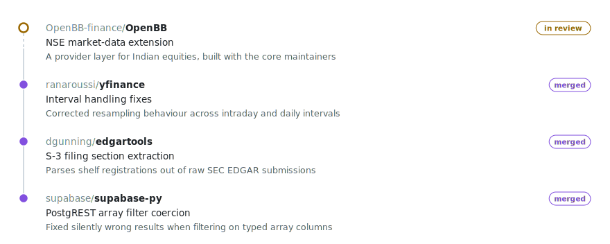

<h2 align="center">Hey, I'm John Kevin</h2>

  Final-year CS at <b>VIT Chennai</b> and on the founding team at <b>WiseFolio</b>, an early-stage fintech, 
  building the data and payment layers behind an equities investing platform. 
  Most of what is left of my week goes to open source in the Python finance ecosystem.

<!-- Tech Stack -->
<h2 align="center">Tech Stack</h2>

  <!-- Row 1 -->
  

    
  

  <!-- Row 2 -->
  

    
  

<!-- Open Source -->
<h2 align="center">Open Source</h2>

  Contributions to the finance and data libraries I actually build on.

<picture>
  <source media="(prefers-color-scheme: dark)" srcset="./assets/oss-dark.svg" />
  
</picture>

  
    <a href="https://github.com/OpenBB-finance/OpenBB/pull/7591">OpenBB #7591</a> ·
    <a href="https://github.com/ranaroussi/yfinance/pull/2780">yfinance #2780</a> ·
    <a href="https://github.com/dgunning/edgartools/pull/899">edgartools #899</a> ·
    <a href="https://github.com/supabase/supabase-py/pull/1530">supabase-py #1530</a>
  

<!-- Stats -->
<h2 align="center">GitHub Stats</h2>

  

  

<!-- Connect Section -->
<h2 align="center">Connect With Me</h2>

  <a href="mailto:johnkevin0742@gmail.com"><kbd>&nbsp;&nbsp;&nbsp;johnkevin0742@gmail.com&nbsp;&nbsp;&nbsp;</kbd></a>
  &nbsp;
  <a href="https://linkedin.com/in/johnkevindev"><kbd>&nbsp;&nbsp;&nbsp;in/johnkevindev&nbsp;&nbsp;&nbsp;</kbd></a>
  &nbsp;
  <a href="https://github.com/gottostartsomewhere?tab=repositories"><kbd>&nbsp;&nbsp;&nbsp;All repositories&nbsp;&nbsp;&nbsp;</kbd></a>

