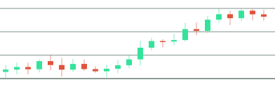

  

<h1 align="center">John Kevin</h1>

  Backend &amp; fintech engineer · Chennai 
  Payments, ledgers, and market-data tooling. Currently all in on open source.

  <a href="https://linkedin.com/in/johnkevindev">LinkedIn</a> ·
  <a href="mailto:johnkevin0742@gmail.com">Email</a> ·
  <a href="https://github.com/gottostartsomewhere?tab=repositories">Repositories</a>

---

Final-year CS at VIT Chennai and on the founding team at **WiseFolio**, an early-stage fintech, building the data and payment layers behind an equities investing platform. Most of what is left of my week goes to open source in the Python finance ecosystem.

### Filled

Merged into the finance and data libraries I actually use.

- **[OpenBB](https://github.com/OpenBB-finance/OpenBB/pull/7591)** &nbsp;`70k ★`&nbsp; building an NSE market-data extension (`obb.nse.*`), alongside the core maintainers
- **[edgartools](https://github.com/dgunning/edgartools/pull/899)** &nbsp; S-3 filing section extraction for the SEC EDGAR library
- **[yfinance](https://github.com/ranaroussi/yfinance/pull/2780)** &nbsp;`24k ★`&nbsp; fixes to interval handling
- **[supabase-py](https://github.com/supabase/supabase-py/pull/1530)** &nbsp; a type-coercion fix in the PostgREST array filters

### Open positions

**[ledger-api](https://github.com/gottostartsomewhere/ledger-api)** &nbsp;·&nbsp; double-entry payment ledger &nbsp;·&nbsp; `FastAPI` `Postgres` `Redis`

Balanced debit/credit rows inside one row-locked transaction so balances can't drift. Idempotent writes (Redis plus a Postgres fingerprint) keep retries safe from double-charges, and settlement events ship through an HMAC-signed transactional outbox that survives a DB rollback.

**[CVA-SACS](https://github.com/gottostartsomewhere/Cva_Sacs)** &nbsp;·&nbsp; equity stress-testing engine &nbsp;·&nbsp; [live demo](https://cvasacs.streamlit.app) &nbsp;·&nbsp; `Python` `XGBoost` `FinBERT`

Stacks gradient-boosted models with CVaR, Monte Carlo, and conformal intervals over ~130 features plus a FinBERT sentiment index into a single 0 to 100 risk score. Walk-forward backtested, with SHAP for explainability. Built to be honest about uncertainty, not just print a number.

### Instruments

`Python` `TypeScript` `C++` `FastAPI` `Node` `PostgreSQL` `Redis` `MongoDB` `SQLAlchemy` `Docker` `AWS` `React` `Next.js`

### Tape

  
  &nbsp;
  

  

---

risk controls: balances reconcile, retries are idempotent, and the webhook always fires.

