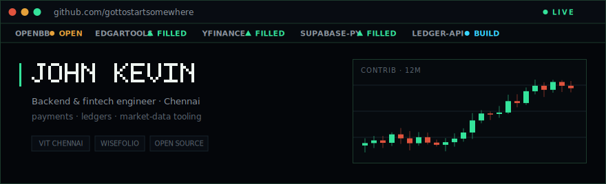
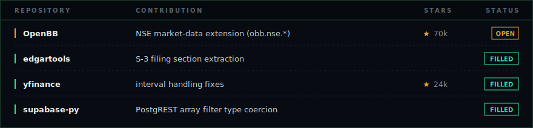
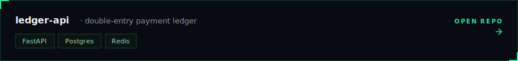
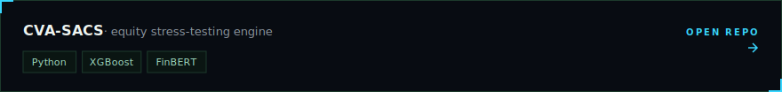

  

  <a href="https://linkedin.com/in/johnkevindev">LinkedIn</a> ·
  <a href="mailto:johnkevin0742@gmail.com">Email</a> ·
  <a href="https://github.com/gottostartsomewhere?tab=repositories">Repositories</a>

Final-year CS at VIT Chennai and on the founding team at **WiseFolio**, an early-stage fintech, building the data and payment layers behind an equities investing platform. Most of what is left of my week goes to open source in the Python finance ecosystem.

  
    <a href="https://github.com/OpenBB-finance/OpenBB/pull/7591">OpenBB #7591</a> ·
    <a href="https://github.com/dgunning/edgartools/pull/899">edgartools #899</a> ·
    <a href="https://github.com/ranaroussi/yfinance/pull/2780">yfinance #2780</a> ·
    <a href="https://github.com/supabase/supabase-py/pull/1530">supabase-py #1530</a>
  

Balanced debit/credit rows inside one row-locked transaction so balances can't drift. Idempotent writes (Redis plus a Postgres fingerprint) keep retries safe from double-charges, and settlement events ship through an HMAC-signed transactional outbox that survives a DB rollback.

Stacks gradient-boosted models with CVaR, Monte Carlo, and conformal intervals over ~130 features plus a FinBERT sentiment index into a single 0 to 100 risk score. Walk-forward backtested, with SHAP for explainability. Built to be honest about uncertainty, not just print a number. &nbsp;[Live demo](https://cvasacs.streamlit.app)

  
  

  

